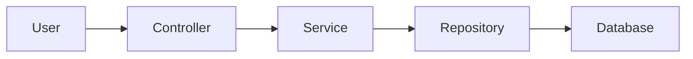

# Documentation Development

This guide explains how to preview the documentation locally using MkDocs Material.

## Quick Start with Docker (Recommended)

The easiest way to preview docs is using Docker:

```bash
# Start the docs service
docker compose up docs

# View at http://localhost:8000
```

The MkDocs server will watch for changes and automatically rebuild with live reload. Press `Ctrl+C` to stop.

## Alternative: Local MkDocs Installation

Not recommended. Use Docker (above) for consistency across all environments.

If you must install locally, ensure you have [Python 3.7+](https://www.python.org/) and run:

```bash
pip install -r docs/requirements.txt
mkdocs serve
```

## Documentation Structure

```
docs/
├── mkdocs.yml              # MkDocs configuration
├── DEVELOPMENT.md          # This file
├── DOCKER.md               # Docker setup guide
├── ARCHITECTURE.md         # System architecture
├── index.md                # Main landing page
├── README.md               # Quick navigation
├── requirements.txt        # Python dependencies
├── stylesheets/
│   └── extra.css          # Custom styling
├── javascripts/
│   └── mathjax.js         # Math rendering
├── includes/
│   └── abbreviations.md   # Term definitions
├── agents/                # Agent documentation
│   ├── index.md
│   ├── backend-agent.md
│   ├── database-architect.md
│   ├── docs-agent.md
│   ├── frontend-agent.md
│   ├── game-balance-architect.md
│   ├── testing-agent.md
│   └── .pages
├── balance-overhaul/      # Game balance documentation
│   ├── 00-INDEX.md
│   ├── 01-PROBLEM-STATEMENT.md
│   └── ...
└── _site/                 # Built documentation (generated)
```

## Writing Documentation

### Markdown Basics

```markdown
# H1 Heading
## H2 Heading
### H3 Heading

**Bold text**
*Italic text*
`code inline`

[Link text](url)

- Bullet point
- Another point

1. Numbered list
2. Second item
```

### Code Blocks with Copy Button

````markdown
```php
// PHP code example
class Example {
    public function method(): void {
        // Code here
    }
}
```

```bash
# Shell commands
docker compose up docs
```
````

All code blocks automatically include a copy button in the top-right corner.

### Admonitions (Callouts)

```markdown
!!! note "Optional Title"
    This is a note admonition.

!!! warning
    This is a warning.

!!! tip "Pro Tip"
    This is a helpful tip.

!!! danger "Critical"
    This is a danger warning.
```

### Tabbed Content

```markdown
=== "PHP"
    ```php
    echo "Hello World";
    ```

=== "JavaScript"
    ```javascript
    console.log("Hello World");
    ```

=== "Bash"
    ```bash
    echo "Hello World"
    ```
```

### Tables

```markdown
| Column 1 | Column 2 | Column 3 |
|----------|----------|----------|
| Cell 1   | Cell 2   | Cell 3   |
| Cell 4   | Cell 5   | Cell 6   |
```

### Mermaid Diagrams

````markdown

````

### Abbreviations

Define abbreviations in `docs/includes/abbreviations.md`, then use them in your docs:

```markdown
The MVC pattern is used throughout the codebase.
```

The abbreviation will be automatically expanded on hover.

### Task Lists

```markdown
- [x] Completed task
- [ ] Pending task
- [ ] Another pending task
```

## Testing Changes

Before committing documentation changes:

1. **Preview locally** to verify formatting
2. **Check all internal links** work
3. **Verify code examples** are correct
4. **Test on mobile** view (resize browser)
5. **Check tables** render properly
6. **Verify admonitions** display correctly
7. **Test dark/light mode** toggle

## Building Static Site

To build the static documentation site:

```bash
# Using Docker
docker compose run --rm docs build

# Using Python
mkdocs build
```

The built site will be in the `site/` directory.

## GitHub Pages Deployment

Documentation is automatically deployed via GitHub Actions when:

- Changes are pushed to `master` branch
- Files in `docs/` or `mkdocs.yml` are modified
- PR is opened to `master` branch (tests build, doesn't deploy)

The workflow file: `.github/workflows/deploy-docs.yml`

### Manual Deployment

You can manually trigger deployment:

1. Go to repository on GitHub
2. Click "Actions" tab
3. Select "Build and Deploy Documentation" workflow
4. Click "Run workflow"

## Troubleshooting

### MkDocs Build Errors

```bash
# Check for syntax errors (strict mode)
mkdocs build --strict

# Clear build cache
rm -rf site/

# Rebuild
mkdocs serve
```

### Port Already in Use

```bash
# Check what's using port 8000
lsof -i :8000

# Kill the process or change port in .env
echo "DOCKER_DOCS_PORT=8001" >> .env
docker compose up docs
```

### Changes Not Appearing

1. Hard refresh browser: `Ctrl+Shift+R` (or `Cmd+Shift+R` on Mac)
2. Clear browser cache
3. Check browser console for errors
4. Restart MkDocs server

### Missing Dependencies

```bash
# Install all Python dependencies
pip install -r docs/requirements.txt

# Verify installation
mkdocs --version
```

### File Path Issues

- Use relative paths with `/` (not `\` on Windows)
- Example: `docs/agents/backend-agent.md` ✅
- Not: `docs\agents\backend-agent.md` ❌

## Live Reload

MkDocs includes automatic live reload:

- Make changes to any `.md` file in `docs/`
- Make changes to `mkdocs.yml` or CSS/JS files
- Save the file
- Browser automatically refreshes
- See changes immediately

## Performance Tips

- Keep documentation focused and concise
- Use clear headings for better navigation
- Link related documentation pages
- Include real code examples from the codebase
- Use tables for structured information
- Add diagrams for complex concepts

## Writing Best Practices

- **Keep docs concise** - Developers prefer brief, clear explanations
- **Use real examples** - Take code from actual codebase
- **Include both right and wrong** - Show good and bad patterns
- **Link related docs** - Cross-reference relevant pages
- **Update when code changes** - Keep docs in sync with code
- **Test all commands** - Verify shell commands actually work
- **Use active voice** - "The service validates input" not "Input is validated"
- **Be consistent** - Use same terminology throughout docs

## Resources

- [MkDocs Documentation](https://www.mkdocs.org/)
- [Material for MkDocs](https://squidfunk.github.io/mkdocs-material/)
- [PyMdown Extensions](https://facelessuser.github.io/pymdown-extensions/)
- [Markdown Guide](https://www.markdownguide.org/)
- [Mermaid Diagrams](https://mermaid.js.org/)
- [GitHub Pages Documentation](https://docs.github.com/en/pages)

## Getting Help

- Documentation issues: Check existing docs for examples
- MkDocs errors: Consult [MkDocs documentation](https://www.mkdocs.org/)
- Material theme: Check [Material for MkDocs](https://squidfunk.github.io/mkdocs-material/)
- GitHub Pages: Check GitHub Actions logs in repository
- Code examples: Refer to actual codebase in `app/` directory

