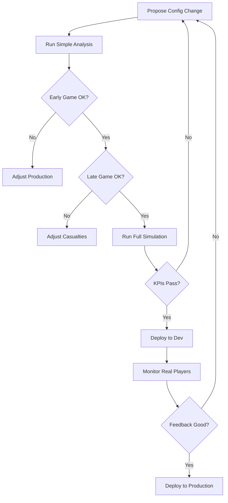

# Balance Simulation Engine

## Overview

The Balance Simulation Engine is a comprehensive testing framework for validating game balance changes before deployment. It simulates actual gameplay across multiple player archetypes to measure:

- **Casualty rates vs. production rates** - Can players replenish armies?
- **Wealth inequality** - Is wealth concentration healthy or oligarchic?
- **Power gaps** - Do engaged players dominate casual players?
- **Economy balance** - Are income and costs balanced?
- **Progression curves** - Is advancement smooth across all levels?

## The Core Problem

Based on analysis of current configuration, we've identified a **progression paradox**:

### Current State
- **Casualty Scalar**: 0.1 (reduces casualties by 90%)
- **Citizen Production**: 1 per population level per turn (288/day at Level 1)

### The Paradox
1. **Documentation says**: "Casualties are too LOW, combat is toothless"
2. **Players complain**: "Cannot replenish units fast enough"

### Root Cause
**Both are true at different progression stages:**

- **Early Game (Level 1-10)**: 
  - Production: 288-2,880 citizens/day
  - Medium battle casualties: ~1,000 units
  - Result: Takes 1-4 days to recover from ONE battle
  - **Player experience**: "I can't fight, I run out of troops!"

- **Late Game (Level 30+)**:
  - Production: 8,640+ citizens/day  
  - Medium battle casualties: ~1,000 units
  - Result: Can fight 8+ battles per day
  - **Player experience**: "Combat doesn't matter, I have infinite troops"

## Architecture

The simulation engine consists of four components:

### 1. BalanceSimulationEngine
Core simulation logic that processes turns, manages resources, and executes player strategies.

**Key Features:**
- Turn-by-turn simulation (288 turns/day)
- Income processing (economy, workers, interest)
- Maintenance costs (if configured)
- Combat resolution
- Snapshot recording (every 10 days)

### 2. SimulatedPlayer
Represents a player with:
- Resources (credits, banked credits)
- Units (soldiers, guards, citizens)
- Structures (economy, population, fortifications)
- Combat statistics
- Economy tracking

**Archetypes:**
- **Casual**: 1 login/day, 0.3 attacks/day, focuses on economy
- **Engaged**: 3 logins/day, 1.5 attacks/day, balanced build
- **Turtle**: 0.5 logins/day, 0 attacks/day, hoards resources

### 3. SimulationResult
Analyzes simulation outcomes:
- Calculates Gini coefficient (wealth inequality)
- Tracks power gaps between archetypes
- Validates against KPI thresholds
- Generates detailed reports

### 4. Test Runners
- **balance_simulation_test.php** - Full 90-day simulation (requires PHP 8.4+)
- **simple_balance_analysis.php** - Quick mathematical analysis (works on any PHP version)

## Usage

### Quick Analysis (No Dependencies)
```bash
php tests/simple_balance_analysis.php
```

This analyzes:
- Casualty rates at different battle sizes
- Production rates at different population levels
- Replenishment times
- Sustainable combat frequency

### Full Simulation (Requires PHP 8.4+)
```bash
# Run in Docker container
docker compose exec app php tests/balance_simulation_test.php

# Or locally if you have PHP 8.4+
php tests/balance_simulation_test.php
```

This simulates:
- 90 days of gameplay
- 3 player archetypes (Casual, Engaged, Turtle)
- Real combat interactions
- Economy evolution
- Validates against KPI thresholds

## Key Metrics (KPIs)

### Wealth Inequality (Gini Coefficient)
- **Target**: < 0.65 (healthy inequality)
- **Warning**: 0.65 - 0.72 (oligarchy forming)
- **Critical**: > 0.72 (oligarchy entrenched)

### Top 1% Wealth Share
- **Target**: < 35%
- **Warning**: 35% - 45%
- **Critical**: > 45%

### Power Gap (Engaged vs Casual)
- **Day 30**: ≤ 2.0× (engaged ahead, not dominating)
- **Day 90**: ≤ 2.5× (gap widens but catchable)

### Casualty Replenishment
- **Target**: ≤ 14 days to replenish from average battle
- **Warning**: > 14 days
- **Critical**: > 30 days

## Recommended Balance Changes

Based on analysis, we recommend **Option D: Balanced Approach**:

### Changes to `/config/game_balance.php`:

```php
// Turn Processor
'turn_processor' => [
    'citizen_growth_per_pop_level' => 3,  // Was: 1 (3× increase)
    // ... rest unchanged
],

// Attack System
'attack' => [
    'global_casualty_scalar' => 0.15,  // Was: 0.1 (50% increase, gradual)
    
    // Nanite Forge (if exists)
    'nanite_casualty_reduction_per_level' => 0.005,  // Was: 0.01
    'max_nanite_casualty_reduction' => 0.25,        // Was: 0.50
],
```

### Why These Numbers?

#### Citizen Production: 1 → 3 per level per turn
- **Level 1**: 864 citizens/day (was 288)
  - Can fight every 1-2 days comfortably
  - Early game feels engaging, not grindy

- **Level 10**: 8,640 citizens/day (was 2,880)
  - Can sustain 3-8 battles/day
  - Rewards investment in population

- **Level 30**: 25,920 citizens/day (was 8,640)
  - Can sustain heavy combat
  - Still feels earned, not infinite

#### Casualty Scalar: 0.1 → 0.15
- Winner losses: 0.75% - 2.25% (was 0.5% - 1.5%)
- Loser losses: 3% - 6% (was 2% - 4%)
- **Impact**: Combat feels more consequential without being devastating
- **Gradual**: Not the full 0.22 suggested in docs (too aggressive)

#### Nanite Forge Cap: 50% → 25%
- Prevents late-game invulnerability
- Elite players still get advantage (25% reduction is strong)
- Combat remains consequential even for veterans

### Validation Process

1. **Run simple analysis** with new config:
   ```bash
   php tests/simple_balance_analysis.php
   ```

2. **Review replenishment times** - Should be ≤7 days for Level 10+

3. **Check combat frequency** - Level 10 should sustain 1+ attacks/day

4. **Run full simulation** (if PHP 8.4+ available):
   ```bash
   php tests/balance_simulation_test.php
   ```

5. **Validate KPIs**:
   - ✅ Gini < 0.65
   - ✅ Top 1% < 35%
   - ✅ Power gap ≤ 2.5× at Day 90
   - ✅ Replenishment ≤ 14 days

## Alternative Configurations

### Conservative Approach (Minimal Change)
```php
'citizen_growth_per_pop_level' => 2,  // 2× instead of 3×
'global_casualty_scalar' => 0.12,     // 20% increase instead of 50%
```
- Lower risk
- May not fully resolve early-game frustration

### Aggressive Approach (Match Documentation)
```php
'citizen_growth_per_pop_level' => 5,  // 5× increase
'global_casualty_scalar' => 0.22,     // Full 2.2× increase
```
- Matches original balance overhaul proposal
- Higher risk of overshooting
- Requires careful monitoring

### With Maintenance Costs
```php
'maintenance' => [
    'soldiers' => 50,   // 50 credits/turn per soldier
    'guards' => 75,     // 75 credits/turn per guard
    'disband_on_negative' => true,
],
```
- Creates ongoing pressure to stay active
- Risk: Punishes active players
- Only viable with higher base income

## Testing Workflow



## Files

- `/tests/BalanceSimulation/BalanceSimulationEngine.php` - Core simulation engine
- `/tests/BalanceSimulation/SimulatedPlayer.php` - Player entity
- `/tests/BalanceSimulation/SimulationResult.php` - Results analysis
- `/tests/balance_simulation_test.php` - Full test runner
- `/tests/simple_balance_analysis.php` - Quick analysis tool
- `/docs/game-balance/simulation-engine.md` - This file

## Next Steps

1. **Review proposed changes** with design team
2. **Run simulations** with proposed config
3. **Deploy to dev server** for testing
4. **Monitor metrics** for 7 days
5. **Gather player feedback**
6. **Adjust if needed**
7. **Deploy to production** once validated

## Maintenance

This simulation engine should be run:
- **Before** every balance patch
- **After** major feature additions
- **Weekly** on production data to validate health
- **When** players report balance issues

Balance is not set-and-forget. It requires continuous monitoring and adjustment.
